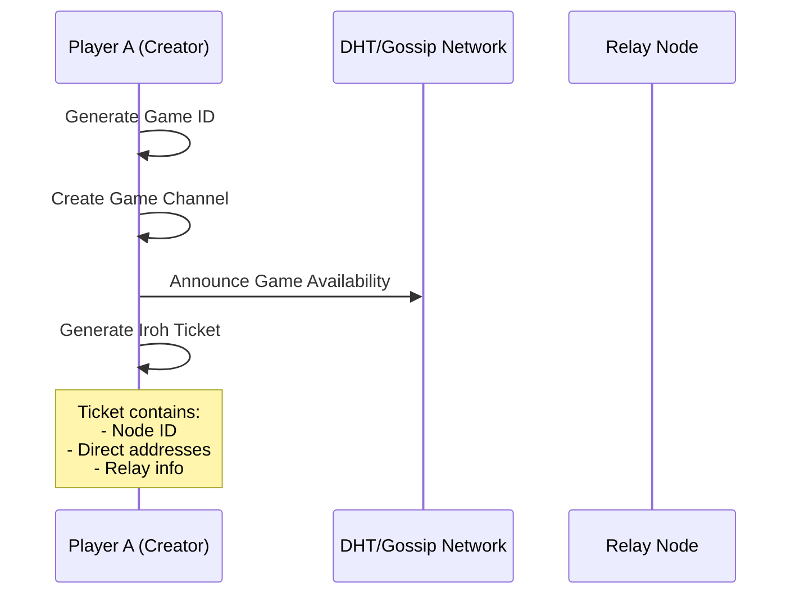
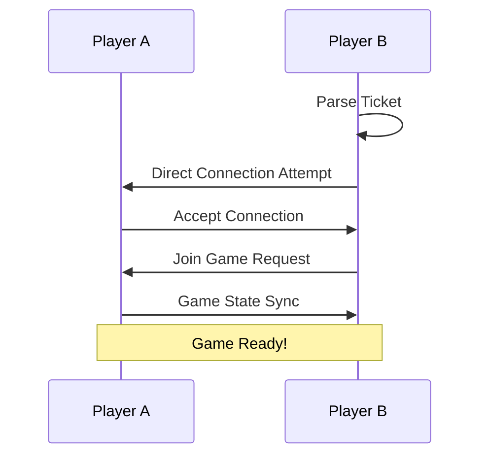

# P2P Go Architecture Specification

## Overview

P2P Go implements a fully decentralized Go game using modern peer-to-peer networking technologies. This specification details the architecture, protocols, and design decisions that enable serverless multiplayer Go.

## Core Principles

1. **No Central Servers** - All game state and communication happens directly between peers
2. **NAT Traversal** - Works behind firewalls and routers without manual configuration
3. **Resilient Connections** - Automatic reconnection and state synchronization
4. **Privacy First** - No data collection, analytics, or third-party services

## Network Stack

### Transport Layer

P2P Go uses a hybrid approach combining multiple protocols:

```
┌─────────────┐
│   Game UI   │
└──────┬──────┘
       │
┌──────▼──────┐
│  Game Logic │
└──────┬──────┘
       │
┌──────▼──────┐
│   libp2p    │ ← Protocol multiplexing, encryption
├─────────────┤
│    Iroh     │ ← Direct connections, NAT traversal
├─────────────┤
│    QUIC     │ ← Reliable, low-latency transport
└─────────────┘
```

### Key Technologies

1. **libp2p** (v0.53)
   - Protocol negotiation and multiplexing
   - Peer identity and discovery
   - Stream multiplexing with Yamux
   - Noise protocol for encryption

2. **Iroh** (v0.25)
   - STUN/TURN-like NAT traversal
   - Direct connection establishment
   - Relay fallback for difficult NATs
   - Ticket-based addressing

3. **QUIC Transport**
   - UDP-based with reliability
   - Built-in encryption
   - Low connection overhead
   - Multiplexed streams

## Connection Establishment

### 1. Game Creation Flow



### 2. Direct Connection (Happy Path)



### 3. Relay Fallback (NAT Traversal Failed)

```mermaid
sequenceDiagram
    participant A as Player A
    participant R as Relay
    participant B as Player B
    
    B->>R: Connect to Relay
    R->>A: Relay Connection Request
    A->>R: Accept Relayed Connection
    Note over A,R,B: All game traffic flows through relay
```

## Game Protocol

### Message Types

```rust
pub enum GameMessage {
    // Connection Management
    JoinRequest { player_name: String, ticket: String },
    JoinResponse { accepted: bool, game_state: GameState },
    
    // Game Moves
    Move { move: Move, signature: Signature },
    MoveAck { move_hash: Hash, seq: u64 },
    
    // Synchronization
    SyncRequest { last_known_move: u64 },
    SyncResponse { moves: Vec<SignedMove>, current_state: GameState },
    
    // Game Flow
    UndoRequest { move_seq: u64 },
    UndoResponse { accepted: bool },
    Resign { signature: Signature },
    
    // Keep-alive
    Heartbeat { timestamp: u64 },
}
```

### Move Validation Chain

Each move is cryptographically signed and forms a hash chain:

```rust
pub struct SignedMove {
    pub move: Move,
    pub sequence: u64,
    pub previous_hash: Hash,
    pub timestamp: u64,
    pub player_signature: Signature,
}
```

This ensures:
- Move authenticity (can't forge opponent's moves)
- Move ordering (prevents replay attacks)
- Game integrity (hash chain validates history)

## State Synchronization

### Consistency Model

P2P Go uses an **Eventually Consistent** model with conflict resolution:

1. **Optimistic Updates** - Apply moves locally immediately
2. **Acknowledgment Required** - Moves must be ACK'd within 3 seconds
3. **Automatic Rollback** - Unacknowledged moves are reverted
4. **Full Sync** - Periodic full state exchange for recovery

### Sync Protocol

```rust
// Every 10 moves or 30 seconds
if needs_sync() {
    let sync_req = SyncRequest {
        last_known_move: self.move_count,
        state_hash: self.game_state.hash(),
    };
    
    match peer.request_sync(sync_req).await {
        Ok(SyncResponse { moves, current_state }) => {
            self.validate_and_apply_moves(moves)?;
            self.verify_state(current_state)?;
        }
        Err(_) => self.mark_connection_degraded(),
    }
}
```

## Discovery Mechanisms

### 1. Local Network Discovery (mDNS)

- Automatic discovery on LAN
- Zero configuration
- Broadcasts game availability
- Range: Same subnet only

### 2. DHT-based Discovery

- Global game discovery
- Topic-based pub/sub
- Game metadata sharing
- Privacy: Only game ID exposed

### 3. Direct Ticket Sharing

- Most common method
- Complete privacy
- Works across any network
- Contains all connection info

## Security Considerations

### Peer Authentication

```rust
// Each peer has an Ed25519 keypair
pub struct PeerIdentity {
    pub public_key: PublicKey,
    private_key: SecretKey,
}

// All game messages are signed
impl SignedMessage {
    pub fn verify(&self, peer_key: &PublicKey) -> bool {
        peer_key.verify(&self.payload, &self.signature)
    }
}
```

### Game Integrity

1. **Move Signing** - Every move is cryptographically signed
2. **Hash Chain** - Moves reference previous move hash
3. **State Verification** - Periodic full state hash comparison
4. **Replay Protection** - Timestamp and sequence number validation

### Privacy Features

- **No Server Logs** - No central point of data collection
- **Encrypted Transport** - All connections use Noise protocol
- **Local Storage Only** - Games saved locally in CBOR format
- **No Analytics** - Zero tracking or telemetry

## Relay Architecture

### When Relays Are Needed

1. **Symmetric NAT** - Both players behind strict NATs
2. **Corporate Firewalls** - Restrictive outbound rules
3. **Mobile Networks** - Carrier-grade NAT
4. **Geographic Distance** - Sometimes helps with routing

### Relay Selection

```rust
pub enum RelayStrategy {
    // Use closest relay by latency
    Nearest,
    
    // Use relay in specific region
    Regional(Region),
    
    // Use specific trusted relay
    Explicit(RelayId),
    
    // Try multiple relays
    Redundant(Vec<RelayId>),
}
```

### Future: Incentivized Relay Network

Players can earn credits by running relays:

```rust
pub struct RelayIncentive {
    // Earn credits for relaying data
    pub credits_per_mb: u64,
    
    // Spend credits to use relays
    pub cost_per_game: u64,
    
    // Reputation system
    pub reliability_score: f32,
}
```

## Performance Optimizations

### Connection Pooling

- Reuse connections for multiple games
- Keep-alive for instant rematch
- Background connection warming

### Message Batching

```rust
// Bundle multiple updates
pub struct MessageBatch {
    pub moves: Vec<Move>,
    pub acks: Vec<MoveAck>,
    pub heartbeat: Heartbeat,
}
```

### Adaptive Quality

- Measure RTT and packet loss
- Adjust heartbeat frequency
- Switch between direct/relay dynamically

## Error Recovery

### Connection Loss Handling

1. **Immediate** - Buffer outgoing moves
2. **10 seconds** - Show "reconnecting" UI
3. **30 seconds** - Try alternate connection methods
4. **2 minutes** - Offer to save game locally

### State Recovery

```rust
pub enum RecoveryStrategy {
    // Fast - just sync recent moves
    Incremental { from_move: u64 },
    
    // Full - complete state transfer
    Complete { include_history: bool },
    
    // Snapshot - compressed state at move N
    Snapshot { at_move: u64 },
}
```

## Future Enhancements

### 1. Multi-Game Sessions
- Run multiple games simultaneously
- Tournament bracket support
- Spectator mode with controlled broadcast

### 2. Advanced NAT Traversal
- UPnP/NAT-PMP support
- ICE candidate gathering
- Predictive connection establishment

### 3. Blockchain Integration
- Record game results on-chain
- Decentralized ELO ratings
- Tournament prize pools

### 4. Federation Support
- Bridge to other Go servers
- Import/export to OGS, KGS
- Universal game history

## Testing Infrastructure

### Local Testing

```bash
# Simulate various network conditions
p2pgo --test-mode --latency 100ms --packet-loss 5%

# Run relay locally
p2pgo --relay-only --port 9999

# Connect through local relay
p2pgo --relay localhost:9999
```

### Integration Tests

- Docker compose for multi-node testing
- Simulated NAT environments
- Automated game scenarios
- Stress testing with 100+ concurrent games

## Conclusion

P2P Go's architecture prioritizes user privacy, connection reliability, and true decentralization. By combining modern P2P protocols with careful protocol design, we achieve a serverless Go experience that rivals traditional client-server implementations.

The architecture is designed to evolve, with clear paths for adding features like tournaments, federations, and blockchain integration without compromising the core peer-to-peer nature of the system.